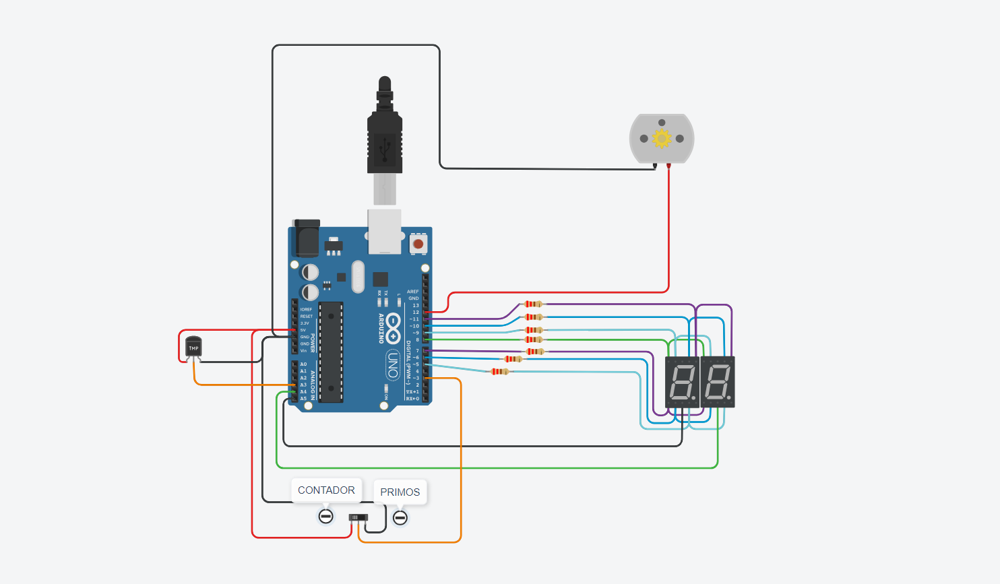

## Integrante
- Alejandro Melnic Fernandez Dionicio

## Proyecto: Sistemas de procesamiento de datos.

## Descripción
La funcion de mi proyecto es mostrar por los 2 display numeros primos o un contador dependiendo si el Slideswitch esta en 1 o 0, Ademas de que tiene incorporado un sensor de temperatura y un motor. Esta funciona dependiendo de la temperatura colocada en el TMP36
si es menor que 60 el moto se apaga o se prende si es mayor a 60

## Función principal
Esta funcion se encarga de encender y apagar los leds del display.

A, B, C, D, E, F, G son #define que utilizamos para agregar los leds del display, asociandolo a pines de la placa arduino.

(La funcion recibe como paremtro el digito que se debe de mostrar en el display )

~~~ C (lenguaje en el que esta escrito)
void printDigit(int digit)
{
  digitalWrite(A, LOW);
  digitalWrite(B, LOW);
  digitalWrite(C, LOW);
  digitalWrite(D, LOW);
  digitalWrite(E, LOW);
  digitalWrite(F, LOW);
  digitalWrite(G, LOW);
  switch (digit)
  {
    case 1:
    
    	digitalWrite(B, HIGH);
    	digitalWrite(C, HIGH);
      	break;
    
    case 2:
    
    	digitalWrite(A, HIGH);
    	digitalWrite(B, HIGH);
    	digitalWrite(D, HIGH);
    	digitalWrite(E, HIGH);
    	digitalWrite(G, HIGH);
      	break;
    
    case 3:
    
    	digitalWrite(A,HIGH);
      	digitalWrite(B,HIGH);
      	digitalWrite(G,HIGH);
      	digitalWrite(C,HIGH);
      	digitalWrite(D,HIGH);
        break;
    
    case 4:
        digitalWrite(F,HIGH);
      	digitalWrite(G,HIGH);
      	digitalWrite(B,HIGH);
      	digitalWrite(C,HIGH);
      	break;
    case 5:
    
      	digitalWrite(A,HIGH);
      	digitalWrite(F,HIGH);
      	digitalWrite(G,HIGH);
      	digitalWrite(C,HIGH);
      	digitalWrite(D,HIGH);
      	break;
    
    case 6:
    
      	digitalWrite(A,HIGH);
      	digitalWrite(F,HIGH);
      	digitalWrite(G,HIGH);
      	digitalWrite(E,HIGH);
      	digitalWrite(C,HIGH);
      	digitalWrite(D,HIGH);
      	break;
    
    case 7:
    
      	digitalWrite(A,HIGH);
      	digitalWrite(B,HIGH);
      	digitalWrite(C,HIGH);
      	break;
    
    case 8:
    
      	digitalWrite(A,HIGH);
      	digitalWrite(B,HIGH);
      	digitalWrite(C,HIGH);
      	digitalWrite(D,HIGH);
      	digitalWrite(E,HIGH);
      	digitalWrite(F,HIGH);
      	digitalWrite(G,HIGH);
      	break;
    
    case 9:
    
      	digitalWrite(A,HIGH);
      	digitalWrite(F,HIGH);
      	digitalWrite(G,HIGH);
      	digitalWrite(B,HIGH);
      	digitalWrite(C,HIGH);
        break;
    
    case 0:
    
      	digitalWrite(A, HIGH);
      	digitalWrite(B, HIGH);
      	digitalWrite(C, HIGH);
      	digitalWrite(D, HIGH);
      	digitalWrite(E, HIGH);
      	digitalWrite(F, HIGH);
      	break;
    
  }
}
~~~

## :robot: Link al proyecto
- [proyecto](https://www.tinkercad.com/things/3wtvJjh8nW9)
## :tv: Link al video del proceso
- [video](https://youtu.be/wMjavLMhmy8)

---
